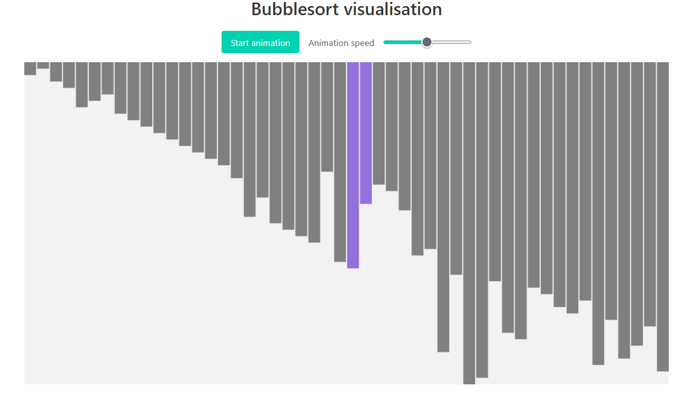

# Bubble sort visualizer

This is a simple HTML5 project that uses a Canvas to display an animation of the Bubblesort sorting algorithm. The code is adapted from [this Medium blog](https://medium.com/wix-engineering/visualizing-bubble-sort-in-5-minutes-using-html5-canvas-api-601dd8435d88) and enhanced with a responsive canvas and other stuff.

